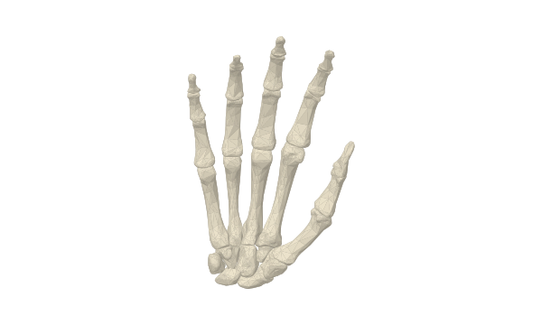

# 拆开看见 · Open Structures

**观察结构，带走素材，保留来路。**

面向中文科普创作者、教师与学习者的三维结构观察工具与可追溯素材目录。



## 已有功能

- **观察与拆分**：旋转、缩放、选择右手骨骼部件，查看英文名称和来源编号；支持分离展示与视角重置。
- **查找与预览**：按关键词、主题、格式、许可和标签筛选素材，预览模型、图片和清单。
- **下载与再创作**：27 个右手骨骼网格的 GLB、部件 CSV、结构参考图片、ZIP 素材包，以及 JSON/CSV 素材目录。
- **来源可追溯**：每项素材包含来源、许可、署名、用途和版本字段。
- **结构影像**：收录约 49 秒的人体结构展示片。完整人体模型不随此仓库分发。

当前为早期项目。没有经过验证的社区用户量、下载量或广泛采用数据。

## 快速运行

需要 Node.js 22.13 或更新版本（建议使用 Node 22 LTS 或 Node 24）及 npm。

```bash
npm ci
npm run dev
```

打开终端显示的本地地址。

```bash
npm run build
npm run preview
```

本发行包使用 React + Vite + TypeScript，三维展示使用 Three.js。
无需 ChatGPT Sites 账号、OpenAI API key、数据库或云服务即可本地运行。
打包结果在 `dist/`。当前静态资源路径以 `/` 开头，请部署到域名根路径；尚不支持直接部署到 GitHub Pages 仓库子路径。

## 素材维护

```bash
python3 scripts/check-assets.py
python3 scripts/prepare-catalog.py
```

校验脚本只使用 Python 标准库，检查 27 个编号、网格/清单一致性、三角形索引和下载路径。
新增素材遵循 [MATERIALS.md](MATERIALS.md)。
可选缩略图生成脚本 `scripts/render-hand-preview.py` 需要 NumPy；日常运行不需要它。

## 源码导航

| 路径 | 功能 |
| --- | --- |
| `app/page.tsx` | 页面、素材搜索与筛选 |
| `app/viewer.tsx` | Three.js 骨骼观察与选择 |
| `app/material-preview.tsx` | 素材预览弹层 |
| `lib/material-search.ts` | 关键词与筛选逻辑 |
| `public/downloads/` | 素材、目录与来源说明 |
| `scripts/` | 目录生成与几何检查 |

## 来源与许可

- 本项目代码：MIT，见 [LICENSE](LICENSE)。
- BodyParts3D 数据与派生素材：CC BY 4.0。模型由 DBCLS 提供，经 ashemag/human-atlas 整理；本项目整理右手子集与展示内容。
- 第三方 UI 和依赖保留自身许可，见 [THIRD_PARTY_NOTICES.md](THIRD_PARTY_NOTICES.md)。

模型是成年男性参考解剖子集。分离动画用于展示，不代表解剖操作路线，不能用于临床判断。

## 参与与后续方向

欢迎提交可复现问题、来源编号核对和文档修订，见 [CONTRIBUTING.md](CONTRIBUTING.md)。
优先改进可复现素材处理、结构标签、键盘访问和实际创作流程。只有经过核验与实际发布的内容才列入已有功能。

---

**English** — Open Structures is a Chinese-first 3D structure viewer and reusable material catalog. Its first collection contains 27 right-hand bone meshes, source identifiers, a GLB download and an attributed parts list. React, Vite and Three.js power the interface. The anatomical geometry is derived from BodyParts3D via human-atlas; it is not original anatomical modeling by this project. This is an early-stage project without verified adoption metrics.
